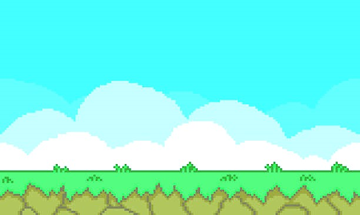

# ゴム人間格闘ゲーム

<p align="center">
  
</p>

<p align="center">
  <a href="https://funahara-masato.github.io/fighting_game/">▶ Play Demo (Web)</a>
  ·
  <a href="#実行方法">Local Setup</a>
</p>

---

Python / Pygame で実装した 2D 格闘ゲーム。「ゴム人間」をモチーフにしたベジェ曲線アームや溜め必殺技など、ビジュアル・ゲームプレイ両面にこだわった作品。

## 特徴

### キャラクター・物理
- **ゴムアーム** — 攻撃時に腕がベジェ曲線で伸び、スナップバック（弾性戻り）する
- **着地スクワッシュ** — 着地時に体がつぶれ、2 段バウンドする
- **歩行サイクル** — 加減速を伴うなめらかな関節アニメーション
- **ダッシュ** — 同方向ダブルタップで急加速、頭が遅れてついてくるラグ演出あり

### 戦闘システム
| システム | 詳細 |
|---------|------|
| **通常攻撃** | 地上で攻撃キーを短押し。リーチ 140px、ダメージ 10 |
| **溜め必殺技（ゴムゴムのピストル）** | 攻撃キーを 42 フレーム長押しでオーラが最大に。離すと超リーチ 220px・ダメージ 20 の必殺技を放つ |
| **空中キック** | 空中で攻撃キーを押すとキックに切り替わり。地上攻撃を高さ 50px 以上で回避できる |
| **ガード** | ガードキーで防御。3 ピップ制で、0 になると 25 フレームの強制スタン |
| **ダッシュ** | 同方向 2 連打で 8 フレームのダッシュ（クールダウンあり） |

### ステージ
- **棘壁** — ステージ両端に棘が生えており、触れるとダメージ＋ノックバック＋55 フレーム無敵

### AI（vs CPU モード）
6 ステートのステートマシンで動作：

| ステート | 内容 |
|---------|------|
| APPROACH | 接敵距離まで近づく |
| IDLE | 攻撃タイミングを見計らう |
| ATTACK | 通常攻撃を仕掛ける |
| CHARGE | 42 フレームかけてオーラを溜め、最大になったら必殺技を放つ（10% 確率で選択） |
| FLANK | 後ろに追い詰められたとき、ジャンプして相手を飛び越えてポジションを入れ替える |
| RETREAT | 攻撃後に距離を取る |

- ランダムジャンプ（0.4% / フレーム）・空中キック（近距離時 4% / フレーム）も実行
- 棘ゾーンへの侵入を自動回避

### 演出・音響
- **溜めオーラ** — 1 フレーム目から徐々に成長する放射状のアルファサーフェスエフェクト（最大時はゴールド色に変化）
- **ガードスパーク** — ガード成功時に飛び散るパーティクル
- **ポップアップテキスト** — 「PISTOL !」「KICK !」がヒットキャラの頭上に浮く
- **スクリーンフラッシュ** — 必殺技ヒット時にオレンジフラッシュ
- **BGM 2 種** — 選択画面・戦闘画面でそれぞれ異なる BGM（numpy 生成の手続き的サウンド）
- **SE 3 種** — 通常ヒット / 必殺技 / ガード（すべて numpy 生成）

## 操作方法

### プレイヤー 1（赤）
| アクション | キー |
|-----------|------|
| 移動 | `A` / `D` |
| ジャンプ | `W` |
| 攻撃（短押し=通常、長押し=溜め必殺） | `S` |
| ガード | `Q` |
| ダッシュ | `A` or `D` を素早く 2 回 |

### プレイヤー 2（青）— PvP のみ
| アクション | キー |
|-----------|------|
| 移動 | `←` / `→` |
| ジャンプ | `↑` |
| 攻撃（短押し=通常、長押し=溜め必殺） | `↓` |
| ガード | `Right Shift` |
| ダッシュ | `←` or `→` を素早く 2 回 |

### 共通
| アクション | キー |
|-----------|------|
| フルスクリーン切り替え | `F11` |

## 実行方法

```bash
git clone https://github.com/Funahara-Masato/fighting_game.git
cd fighting_game
pip install -r requirements.txt
python main.py
```

Windows の場合は `run_app.bat` をダブルクリックでも起動できます。

> **Font**: `meiryo.ttf` をプロジェクトルートに配置する必要があります（Windows では `C:\Windows\Fonts\meiryo.ttf` からコピー）。

## ファイル構成

```
fighting_game/
├── main.py          # メインループ・HUD・勝敗判定
├── fighter.py       # Fighter クラス（描画・物理・AI ステートマシン）
├── config.py        # 定数・Pygame 初期化・numpy 効果音生成
├── select_mode.py   # モード選択画面
├── meiryo.ttf       # フォント
├── assets/
│   ├── bgm.mp3          # 戦闘 BGM
│   ├── hit.mp3          # ヒット SE
│   └── background.jpg   # 背景画像
├── requirements.txt
└── run_app.bat      # Windows 用起動スクリプト
```

## 技術スタック

- **Python 3.12** / **Pygame 2.6.1**
- **NumPy** — 効果音・BGM の手続き的生成（pygame.sndarray）
- ベジェ曲線によるゴムアーム描画
- `pygame.Surface(SRCALPHA)` によるアルファブレンドアニメーション

## 作者

Masato Funahara — funaharamasato@gmail.com
